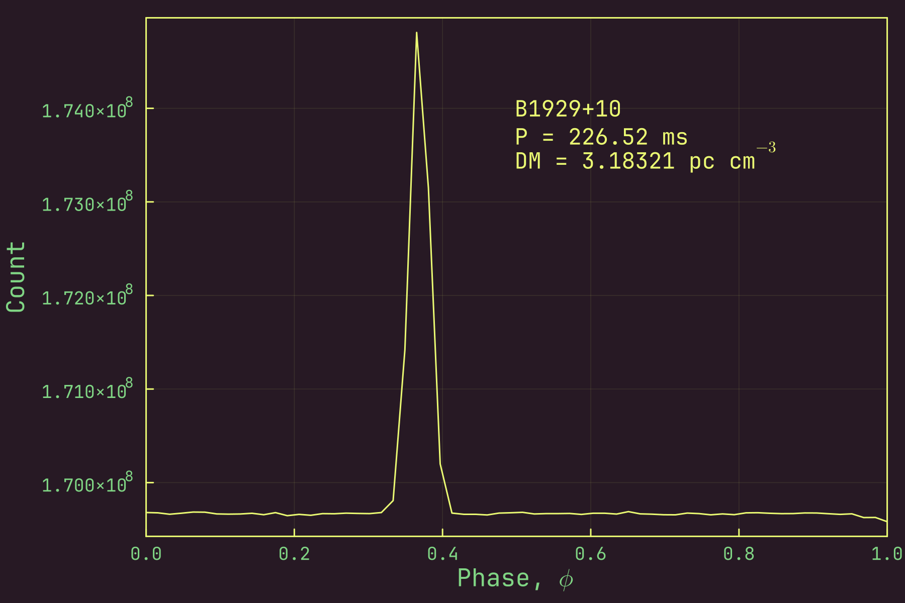

<div align="center">
<h1><code>EpochFolding.jl</code></h1>
<h4><i>Epoch folding, in Julia.</i></h4>
<br/>

![License][license]
![GitHub Stars][stars]
[![Gitmoji Badge][gitmoji_badge]][gitmoji]

<br/>
</div>

<div align="justify">

This package implements **epoch folding** in pure Julia. Epoch folding is a technique used to determine the periodicity of pulsed emission, as seen from sources like pulsars, magnetars, and others. Quoting from [**Bachetti et a. (2021)**](https://iopscience.iop.org/article/10.3847/1538-4357/abda4a):

>Let $(t _{j}, X _{j}) \forall j = 1, \dots N$ be pairs of flux measurements $X _{j}$ at times $t _{j}$. If we define $f$ as the candidate, and $\dot f, \ddot f, \dots$ as the frequency derivatives measured at a reference time $t _{\mathrm{ref}}$, we calculate the pulse phase of each $X _{j}$ as:
>
>$$\phi _{j}(t) = \phi _{0} + f(t _{j} - t _{\mathrm{ref}}) + 0.5 \dot{f} (t _{j} - t _{\mathrm{ref}})^{2} + \cdots ,$$
>
>where $\phi _{0}$ is the pulse phase at $t _{\mathrm{ref}}$, which is set to zero for unknown or candidate pulsars. [...] The folded or pulsed profile is then a histogram of these phases falling into $N _{\mathrm{bin}}$ equal phase bins between zero and $2\pi$, weighted by the flux in each sample:
>
>$$p _{i} = \sum _{j = 1} ^{N} X _{j} \theta (\phi _{j} - \phi _{\mathrm{mid}, i}), \quad i = 1, \dots, N _{\mathrm{bin}},$$
>
>where
>
>$$\phi _{\mathrm{mid}, i} = 2\pi \frac{i - 0.5}{N _{\mathrm{bin}}}$$
>
>is the phase corresponding to the middle of bin $i$ and
>
>$$
  \theta (x) =
  \begin{cases}
    1, & \text{if}\ |x| < 0.5 / N _{\mathrm{bin}} \\
    0, & \text{otherwise.}
  \end{cases}
$$

While the approach described above is the most common way to fold radio data, some software packages like [**`PRESTO`**][presto] use a slightly different approach: they assume that each sample is finite in duration and "drizzle" it over the appropriate pulse phase bins. Both approaches are implemented in this package; in fact, the code for both approaches is almost directly inspired from the code in `PRESTO`, with the occasional change made for Julia. Like `PRESTO`, this code also calculates and returns the statistics associated with the folded profile, including the $\chi^{2}$ statistic ([**Leahy et al. 1983**](https://ui.adsabs.harvard.edu/abs/1983ApJ...272..256L/abstract)).

Here is an example of using `EpochFolding.jl` to fold data for the pulsar B1929+10:



Install it by typing and running:

```bash
] add EpochFolding
```

in the Julia REPL.

</div>

[gitmoji]: https://gitmoji.dev
[presto]: https://github.com/scottransom/presto
[stars]: https://img.shields.io/github/stars/astrogewgaw/EpochFolding.jl?style=for-the-badge
[gitmoji_badge]: https://img.shields.io/badge/gitmoji-%20😜%20😍-FFDD67.svg?style=for-the-badge
[license]: https://img.shields.io/github/license/astrogewgaw/EpochFolding.jl?style=for-the-badge
